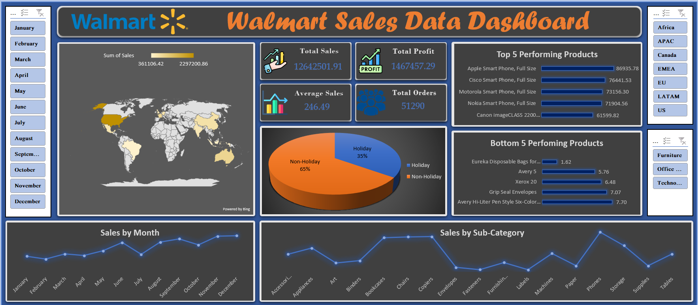

# 🛒 Walmart Sales Performance Dashboard (Excel Project)

## 📌 Project Overview

This project is an **interactive Walmart Sales Dashboard** built entirely in Microsoft Excel.

The objective of this project is to analyze Walmart’s global sales performance and identify trends, top-performing products, seasonal patterns, and regional insights using business intelligence techniques.

The dashboard transforms raw transactional data into meaningful KPIs and dynamic visual insights to support data-driven decision-making.

---

## 🎯 Business Problem

Walmart operates across multiple regions and product categories.
The key business questions addressed in this dashboard are:

* Which regions generate the highest sales?
* How do Holiday vs Non-Holiday sales compare?
* Which products are the top and bottom performers?
* What is the monthly sales trend?
* Which sub-categories receive the most orders?

---

## 📊 Dashboard Overview

The dashboard provides a complete 360° performance view using KPIs, charts, and interactive slicers.

---

## 🔢 Key Performance Indicators (KPIs)

The top section of the dashboard highlights critical business metrics:

* 💰 **Total Sales:** 1,264,250
* 📊 **Average Sales:** 246.49
* 🔥 **Maximum Sales:** 22,638.48
* 📉 **Minimum Sales:** 0.44
* 📈 **Total Profit:** 1,467,457
* 📦 **Total Orders:** 51,290

These KPIs provide a quick snapshot of overall business performance.

---

## 🌍 Sales by Region

This section analyzes how different regions contribute to total revenue.

**Insights:**

* The **Central region** shows the highest sales performance.
* Some regions contribute significantly less, indicating potential growth opportunities.
* Regional comparison helps identify strong and weak markets.

---

## 🎉 Holiday vs Non-Holiday Sales Comparison

A pie chart compares sales generated during holiday and non-holiday periods.

**Insight:**

* Approximately **65% of sales occur during Non-Holiday periods**
* Around **35% of sales occur during Holidays**

This shows that regular business periods drive the majority of revenue.

---

## 🏆 Top 10 Performing Products

This section highlights the highest revenue-generating products.

**Key Observations:**

* The top product generates over **61K in sales**
* There is a noticeable gap between the first and lower-ranked products
* High-performing products can be prioritized for promotions and inventory planning

---

## 📉 Bottom 10 Performing Products

This analysis identifies low-performing products with minimal sales values.

**Business Value:**

* Helps identify products that may require:

  * Pricing adjustments
  * Marketing support
  * Discontinuation evaluation

---

## 📅 Sales by Month (Trend Analysis)

This line chart shows monthly sales performance.

**Insights:**

* Sales show fluctuations across months.
* Peak sales appear toward the end of the year (November–December).
* Seasonal trends can guide inventory and marketing planning.

---

## 📦 Sub-Category Wise Orders

This visualization shows order volume by sub-category.

**Insights:**

* Certain sub-categories like **Binders and Storage** have high order frequency.
* Lower-order categories may need demand generation strategies.

---

## 🎛 Interactive Features

The dashboard includes dynamic slicers for:

* 📆 Month (January–December)
* 🌎 Region (Africa, APAC, Canada, EMEA, EU, LATAM, US)
* 🏢 Category (Furniture, Office Supplies, Technology)

All charts and KPIs update dynamically based on slicer selection, making the dashboard fully interactive.

---

## 🛠 Tools & Techniques Used

* Microsoft Excel
* Pivot Tables
* Pivot Charts
* Slicers
* Map Visualization
* KPI Cards (using shapes and linked cells)
* Conditional Formatting
* Data Cleaning & Transformation

---

## 💡 Business Impact

This dashboard enables:

* Identification of high-revenue regions
* Product performance evaluation
* Seasonal sales forecasting
* Strategic inventory planning
* Data-driven decision making

---

## 🚀 What This Project Demonstrates

As an aspiring Data Analyst, this project showcases my ability to:

* Clean and transform business data
* Design interactive dashboards
* Extract actionable insights
* Apply business intelligence concepts
* Present data in a professional and decision-focused format

---

## 📷 Dashboard Preview

(Add your screenshot here)

```markdown

```

---

# ⭐ Conclusion

This Walmart Dashboard project reflects my practical skills in:

* Data Analysis
* Business Intelligence
* Excel Dashboard Development
* Insight Communication

It demonstrates how raw sales data can be converted into strategic business insights using structured analytical thinking.

